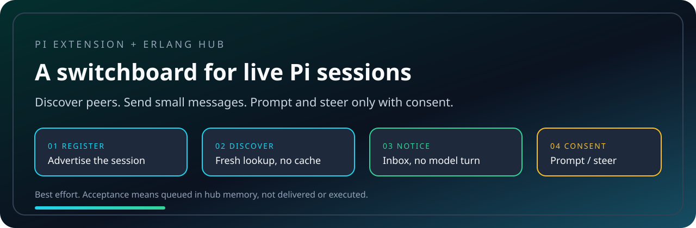
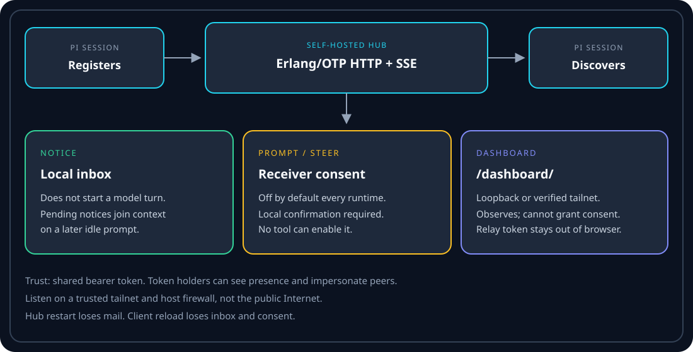

<div align="center">

# pi-switchboard

**A self-hosted relay for live Pi sessions. Discover, notice, prompt, steer.**




`register` -> discover -> notice (no turn) -> prompt/steer only with receiver-local consent.

</div>

---

## Why This Exists

Pi sessions cannot see each other. Copy-paste is the usual way to hand a path,
a constraint, or a "stop" across panes. That does not scale once several agents
are working at once.

Switchboard is a **separately hosted** relay. Sessions register, advertise what
they are doing, and send small messages through it. Installing the Pi extension
does not start a hub.

| Piece | Role |
| --- | --- |
| Erlang/OTP hub | Authenticated HTTP and SSE. Volatile: restart loses mail. |
| Pi client | Source-only extension. Discovers peers and sends messages. |

Nix packages keep those artifacts separate.

## Trust

Token holders can see presence and impersonate peers. Use a trusted tailnet and
an appropriate host firewall. Do not put this on the public Internet or in a
hostile multi-user deployment. A bearer token is not a firewall.

Everything is best effort. Acceptance means queued in hub memory, not delivered
or executed. Hub restart loses mail. Client reload loses inbox and consent.

Prompt and steering require **receiver-local consent**, off by default for every
runtime. No model tool can turn that on. Notices never start a model turn.

## Install

The client needs a running hub and runtime credentials. Choose **one** client
install: the Home Manager module, or Pi's local-package install of this
checkout. Do not load the client twice.

Hub (NixOS):

```nix
services.pi-agent-bus = {
  enable = true;
  tokenFile = "/run/secrets/agent-bus-token";
  # listenAddress defaults to "127.0.0.1"; port defaults to 7420.
};
```

`tokenFile` must be an absolute runtime path, not a Nix path or the secret
value. The module never reads the token at evaluation time.

Client (Home Manager):

```nix
programs.pi-agent-bus.enable = true;
```

That links the complete package at `~/.pi/agent/extensions/agent-bus`. It does
not own Pi wrappers, environment variables, credentials, or consent.

Before launching Pi, supply credentials through your runtime wrapper:

```bash
export PI_AGENT_BUS_URL=http://127.0.0.1:7420
export PI_AGENT_BUS_TOKEN=...
```

The client default URL is `http://terminus:7420`. Set it explicitly for any
other host. `PI_AGENT_BUS_ENABLED=0` disables participation. Offline and
non-TUI sessions stay inert.

Provision the token through secret management. Never embed it in a flake or
repository.

<details>
<summary><strong>Build the packages yourself</strong></summary>

```bash
nix build .#hub --out-link result-hub
nix build .#pi-extension --out-link result-client
```

Run the compiled hub with an absolute credential-file path:

```bash
PI_AGENT_BUS_BIND_HOST=127.0.0.1 \
PI_AGENT_BUS_TOKEN_FILE=/absolute/runtime/path/to/token \
./result-hub/bin/pi-agent-bus
```

Install the complete client package root, not just `index.ts`.

</details>

See [operations](docs/operations.md) for modules, credentials, failure recovery
and rollout, and [compatibility](docs/compatibility.md) before upgrading Pi.

## Commands

| Command | Effect |
| --- | --- |
| `/agents` | Fresh discovery with readiness and control permission |
| `/tell <target> <text>` | Send a notice (no model turn) |
| `/tell --prompt <target> <text>` | Request a consenting peer's next prompt |
| `/tell --steer <target> <text>` | Request steering; can affect active work |
| `/label [text]` | Show or set work label; `--clear` restores the default |
| `/bus` | Connection, identity, unread count, consent, pending slot |
| `/bus inbox` | Read-only local viewer, including while disconnected |
| `/bus control on\|off` | Receiver-local work/guidance consent; on needs confirmation |

Targets resolve by runtime ID, unique prefix of at least eight characters,
exact host, then label substring. Ambiguity stops the send. Quote targets that
contain spaces. `--` ends leading flag parsing. Saved session IDs are not
routing identities.

Discovery is paged and revision-fenced. Failed discovery never silently sends
to a cached or substitute target.

Model tools: `list_agents`, `set_agent_label`, `send_agent_message`,
`report_work`. None of them enable consent.

A lost POST response is **outcome unknown**. Check the peer before resending.
If a control submission never produces its matching user-message event, the
local slot stays occupied; `/reload` clears it and disables consent. Off/on is
not a retry.

<details>
<summary><strong>Operator permissions</strong></summary>

| Command | Effect |
| --- | --- |
| `/bus operator read on\|off` | Current-session inspection and content enrollment |
| `/bus operator manage on\|off` | Typed work assignment, labels, run interruption |
| `/bus operator notices on\|off` | Passive operator notices |
| `/bus operator history on\|off` | Explicit volatile message-preview enrollment |

Browser controls cannot grant these. Enabling through a command needs a local
TUI confirmation.

</details>

## How It Works



| Kind | Starts work? | Needs consent? |
| --- | --- | --- |
| Notice | No. Bounded local inbox; joins context on a later idle prompt | No |
| Prompt | Requests the peer's next prompt | Yes |
| Steer | Can affect active work | Yes |

## Browser dashboard

Enable operator access for loopback or a verified tailnet, then open
`/dashboard/`. The console combines fleet work reports, communications,
current-session inspection, and permission-gated interventions.

No password, pairing, or copied token. The native relay bearer stays out of the
browser. Observation never consumes agent mail. The dashboard cannot enable
receiver permissions.

See the [operator console guide](docs/operator-console.md) and
[deployment boundary](docs/operations.md#browser-dashboard).

## Requirements

| Piece | Used for |
| --- | --- |
| [pi](https://github.com/badlogic/pi-mono) TUI | Host agent and extension API |
| Erlang/OTP hub | Registration, discovery, mail |
| Shared `PI_AGENT_BUS_TOKEN` | Authenticated hub access |
| Trusted tailnet / loopback | Network boundary |

## Development

Use this checkout's direnv environment. See `AGENTS.md` for the full check set.

```bash
direnv exec . npm test
direnv exec . npm run typecheck
```

A passing mock suite or Pi process exit is not runtime acceptance. Run actual
Pi TUI fixtures and compiled hub checks before claiming the relay works.

[Protocol v1](docs/protocol.md) defines limits, schemas, and failure semantics.

## Troubleshooting

<details>
<summary><strong>Extension installed, nothing registers</strong></summary>

The extension does not start a hub. Run the hub, then launch Pi with
`PI_AGENT_BUS_URL` and `PI_AGENT_BUS_TOKEN`. Check `/bus`. The default URL is
`http://terminus:7420`; set it if that is not your host.
`PI_AGENT_BUS_ENABLED=0` disables participation.

</details>

<details>
<summary><strong>Prompt or steer is refused</strong></summary>

Consent starts off. The receiver must run `/bus control on` and confirm in
their TUI. Notices still work without that.

</details>

<details>
<summary><strong>Did the message arrive?</strong></summary>

Acceptance is not delivery. A lost POST is unknown; ask the peer before
resending. Hub restart drops queued mail. Client reload drops the inbox.

</details>

<details>
<summary><strong>Two copies of the client</strong></summary>

Home Manager and a manual/npm install both loaded. Remove the duplicate. The
module links `~/.pi/agent/extensions/agent-bus`.

</details>
